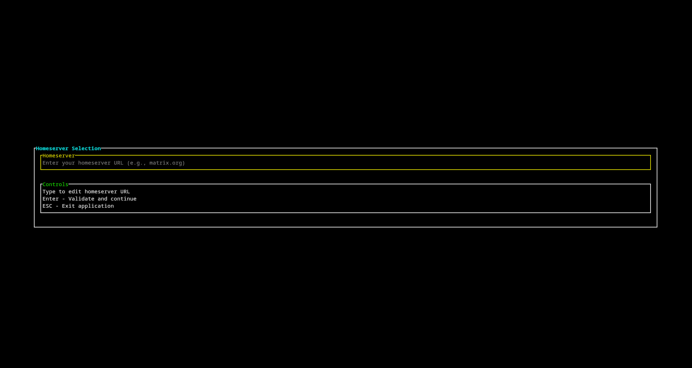
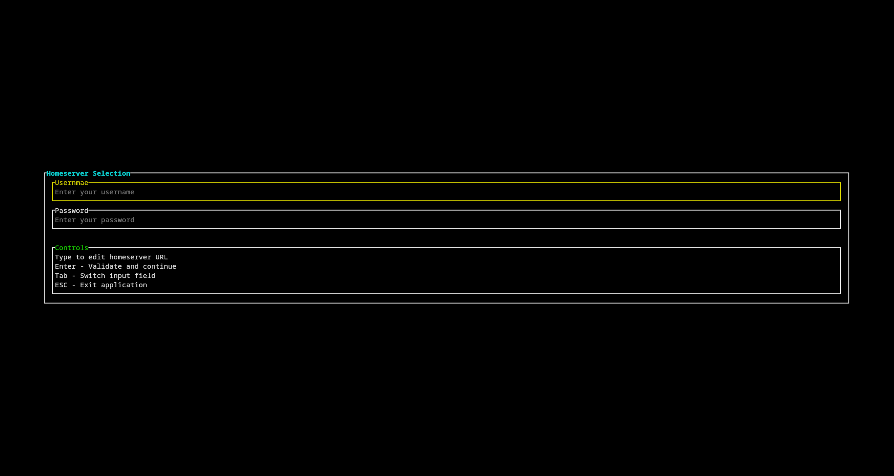
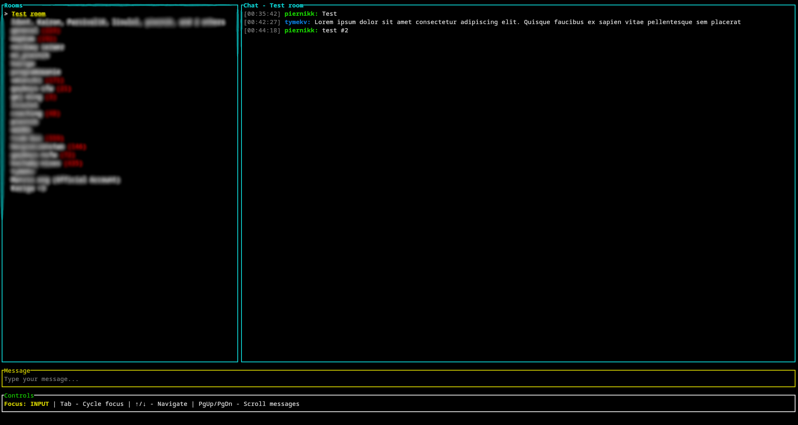

# Clitrix

Simple terminal matrix client

## Demo video:

https://youtu.be/jkgMbvZ5868

## Features:

### Working:

- Homeserver selection and verification
- User login
- Basic chat screen UI rendering
- Fetching and displaying rooms
- Sending messages





### Not yet implemented:

- Real-time message updates
- Login persistence (sessions)
- Message editing and deletion
- Rich message types (images, files, reactions)
- Room creation and management
- User presence indicators
- Typing indicators
- Read receipts
- User switching
- Encrypted rooms support

_As you can see there is a lot of things missing. This is a very early prototype._

### Known Issues

- When messages are loading after login there is no loading indicator
- Messages list is not virtualized, may lag with large histories
- Message history is limited to last 100 messages
- No background sync loop, messages don't auto-refresh

## Technologies:

This project uses the following main libraries:

- [matrix-sdk](https://crates.io/crates/matrix-sdk): Matrix client functionality
- [ratatui](https://crates.io/crates/ratatui): Terminal UI rendering
  Without these libraries it would be much harder and more time consuming to build this project even to this early stage.

## Building and Running

### Dependencies:

- [Rust](https://rustup.rs)

### Steps:

1. Clone the repository:
   ```bash
   git clone https://github.com/Piernikkk/clitrix.git
   cd clitrix
   ```
2. Build using Cargo:

```bash
cargo build --release
```

3. Run the application:

```bash
cargo run --release
```
